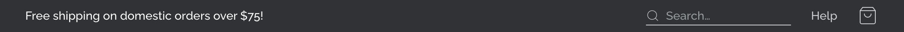
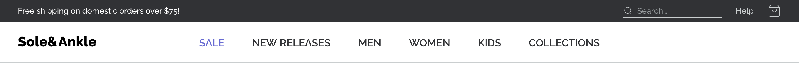
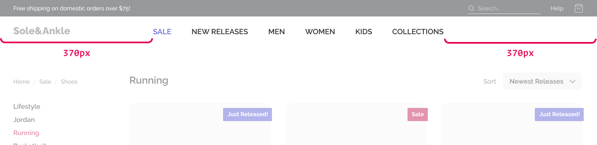
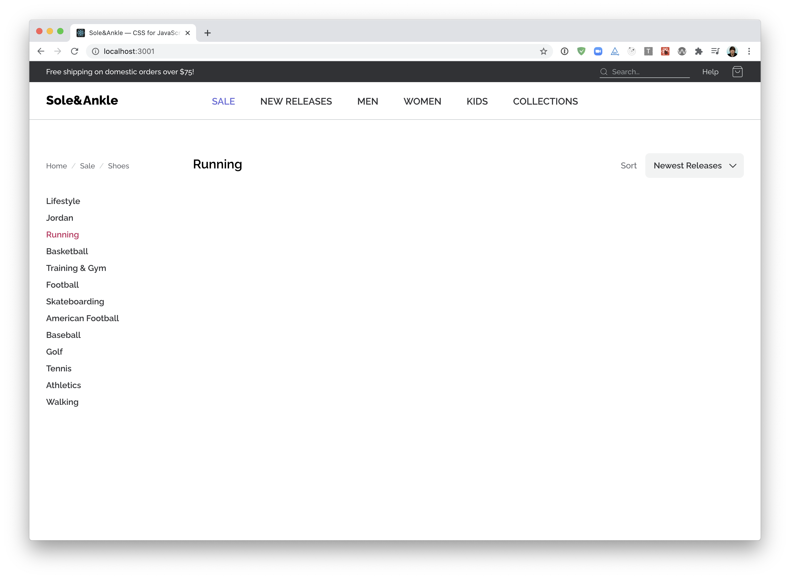
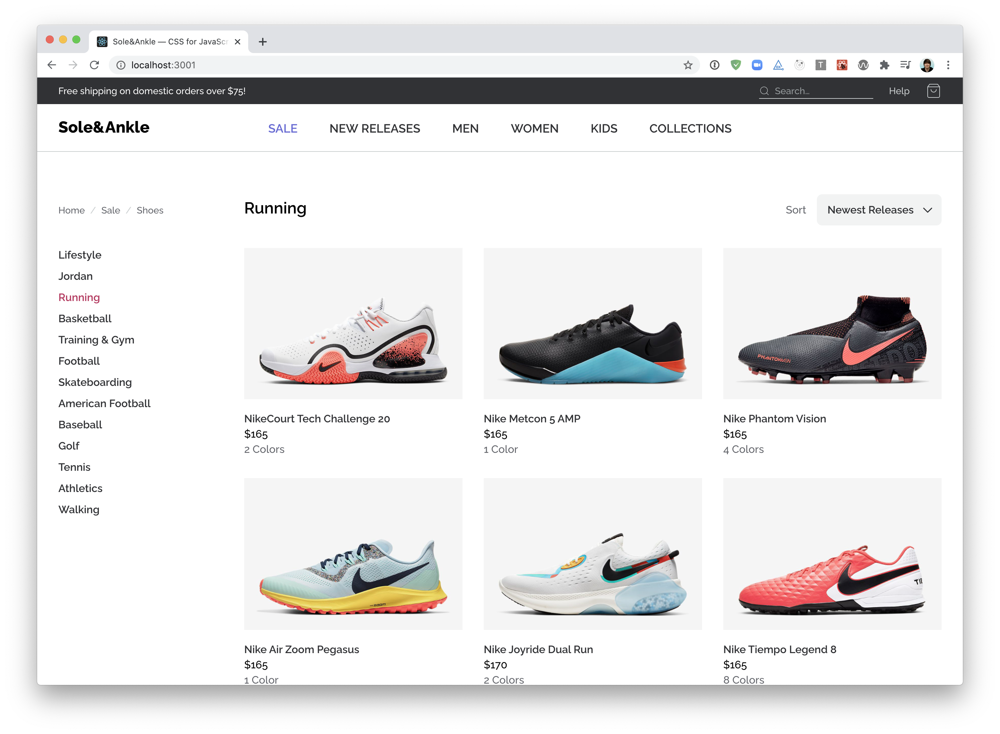
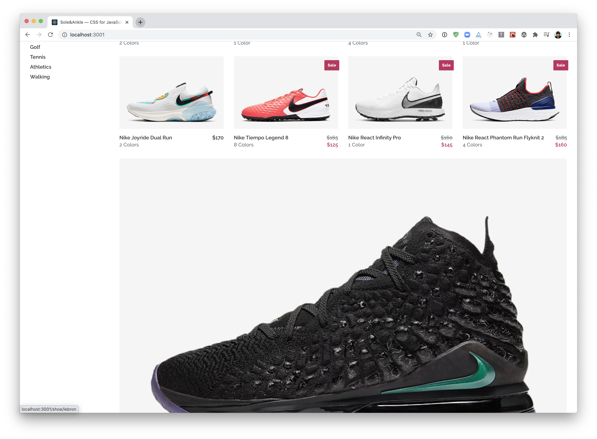
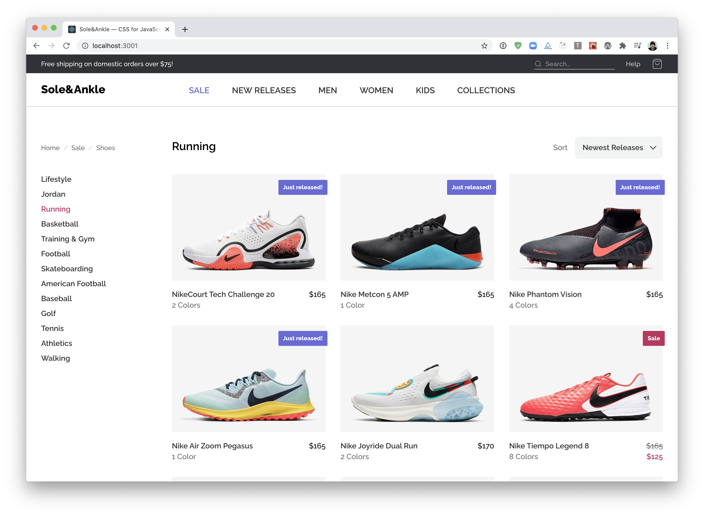

# Sole&Ankle — Module 4 workshop

In this workshop, our goal is to finish building an e-commerce store!

The good news is, most of our work is done already. We just need to write some additional CSS to construct the layout; things are a bit messy right now!

- Access the Figma: https://www.figma.com/file/kAL3AumTUV11y1IqHhltB6/Sole-and-Ankle-%E2%80%94-Mockup

This project uses Create React App. To get started, run the following terminal commands:

- `npm install`
- `npm run start`

You can then visit the app in-browser; it defaults to http://localhost:3000.

_Note that we're only focusing on the design._ The links and inputs don't do anything.

> **Want a bigger challenge?**
>
> This workshop comes with a lot of starter code — we'll be adding
> Flex-specific properties, but for the most part, we don't have a
> ton of code to write. If you'd prefer, you can build the app from
> scratch, to practice all the CSS we've learned so far!
>
> If you go that route, you can find the sneaker assets you need in
> `/public/assets`, and their metadata in `/src/data.js`. Design
> tokens can be found in `/src/constants`. The custom font is
> Raleway, from Google Fonts.

## Troubleshooting

If you run into problems running a local development server, check out our [Troubleshooting Guide](https://courses.joshwcomeau.com/troubleshooting) on the course platform.

This guide addresses the common `Digital Envelope Routine` error you may have seen.

---

## Exercise 1: Superheader

Let's build the “Superheader” a thin grey strip that runs along the top of the page:

Use Flexbox to correctly align the elements within `src/components/SuperHeader`.

## Exercise 2: Header

Continuing on down, let's tackle the main header:

The trickiest part of this exercise is the _position of the main navigation_. We want it to be perfectly centered within the container:

This is a thorny problem, and it's not something we've explicitly seen in the course. Give it your best shot, but please don't be discouraged if you can't figure it out!

## Exercise 3: Shell

Next up, we want to tackle the "framing" around the shoe grid — the sidebar and title/filter.

_NOTE:_ To make life a bit easier, you may wish to comment out the `<ShoeGrid>` component. We'll work on integrating it in the next exercise.

## Exercise 4: Shoe Grid

This exercise features two mini-challenges. The second one is a chance to revisit some of the lessons learned in previous modules, and isn't as specific to Flexbox.

### 4A: Grid layout

Time to tackle the main feature of this application, the shoes!

Here's a screenshot of the final result:

This is a tricky problem to solve with Flexbox—CSS Grid is a better tool for this job! Nevertheless, it can be done using Flexbox, with one caveat: the last row may be oversized:

In a future module, we'll revisit this and see how CSS Grid can help us out :)

## 4B: Final touches

Our sneaker store is in pretty good shape, but there's two small details missing:

1. The “Sale” and “Just Released” flags.
1. The crossed-out prices, for items that are on sale.

Inside `ShoeCard.js`, you'll find a `variant` variable you can use to figure out which flag, if any, needs to be rendered. It's up to you to create the flag, using styled-components.

For the crossed-out prices, you can use the `price` and `salePrice` props.

_NOTE:_ This exercise has minimal flexbox implications, and is mainly about revisiting lessons learned in the previous modules (including positioned layout and styled-components). Feel free to skip it if you'd prefer!

## To be continued!

Our sneaker store can flex to support different screen sizes, but there isn't a proper mobile or tablet view. Don't fret — we will revisit this workshop in a future module!

In the meantime, take a moment to congratulate yourself for making it through the Flexbox module!!
